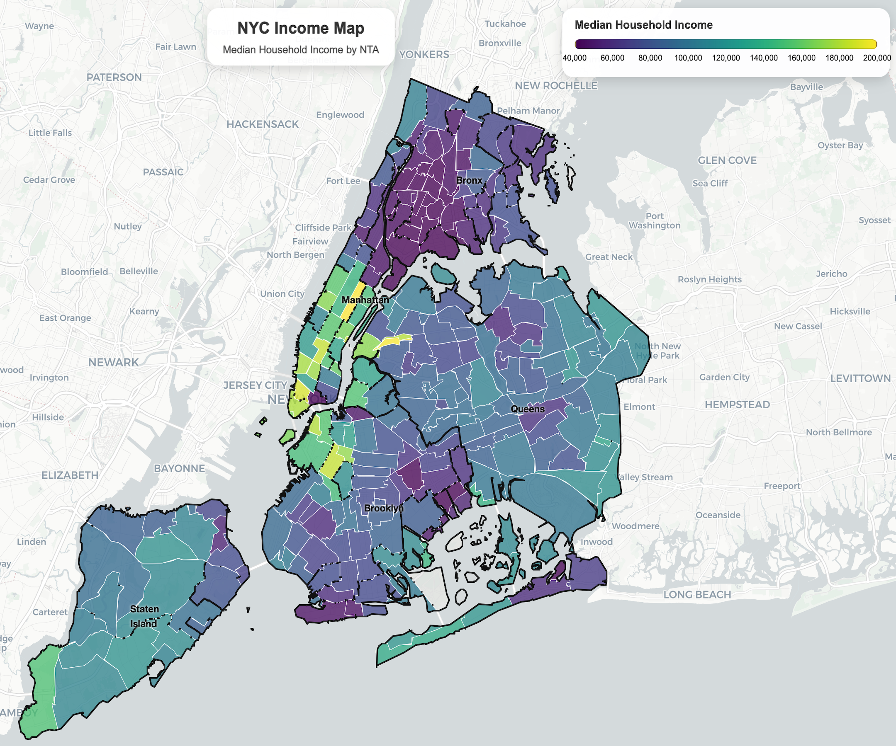
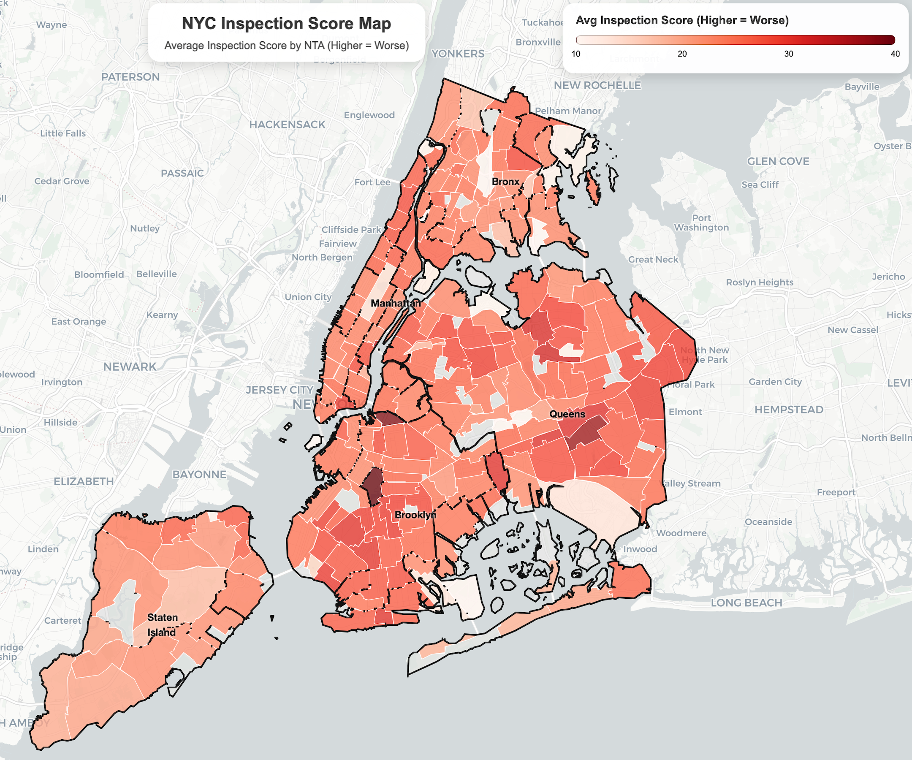
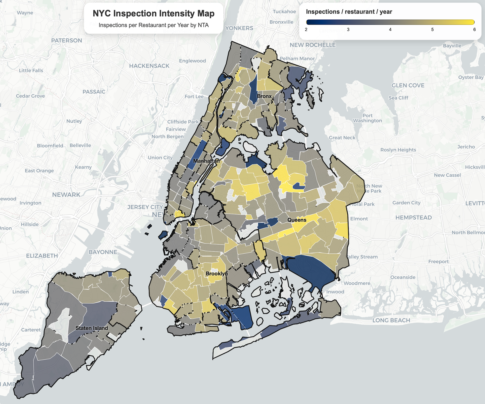
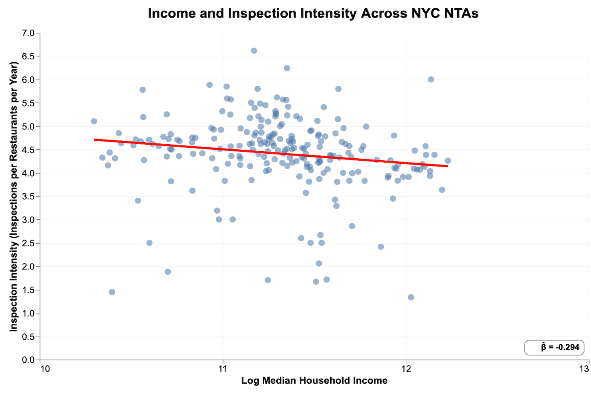
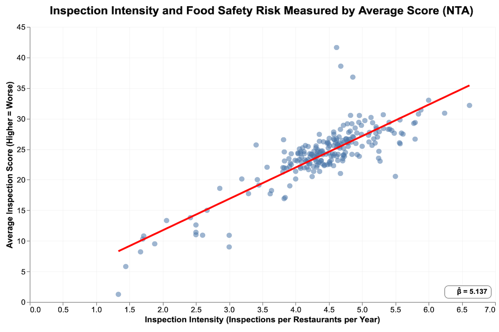
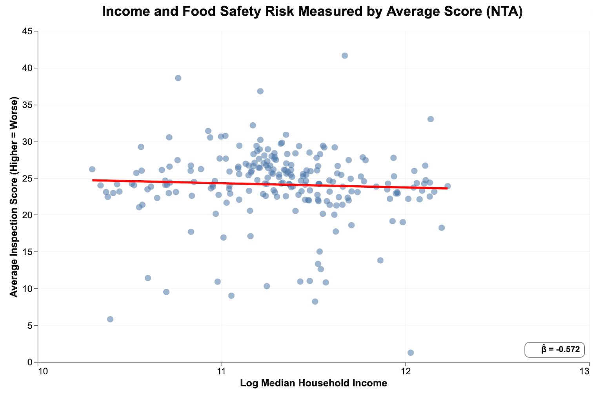
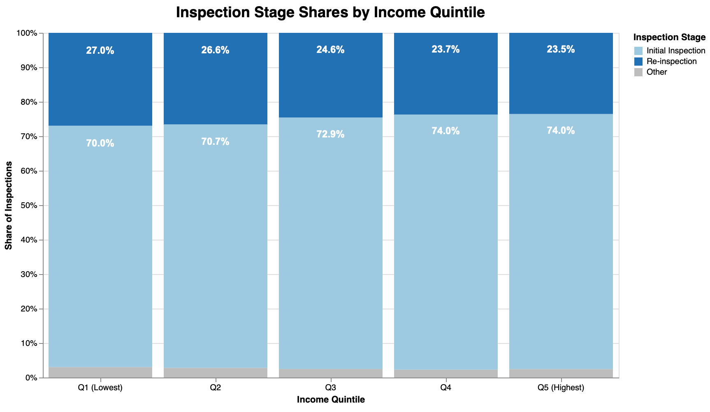
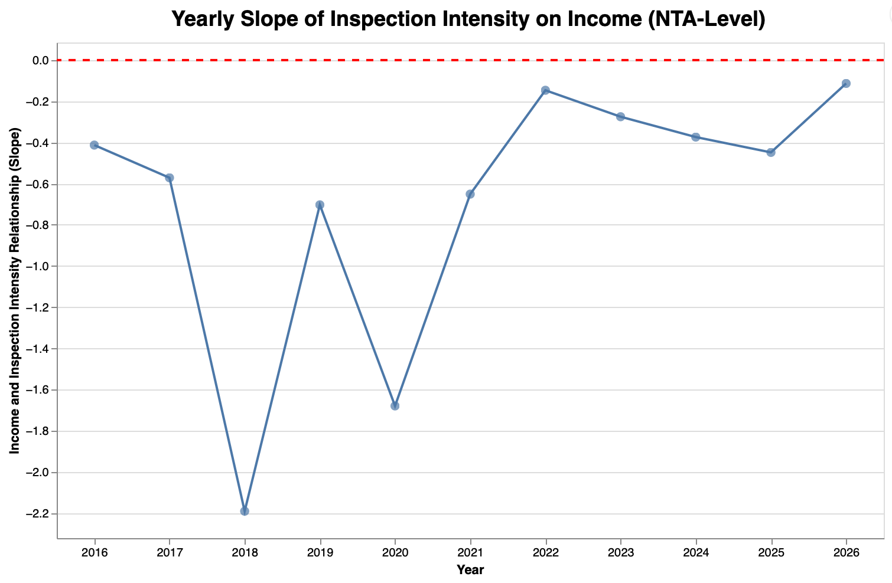

# Group Information

- **Lecture Section (Day/Time):** Section 1, Monday and Wednesday 9:00–10:20
- **GitHub Usernames:** JHYuan19, junyu-hou  
- **Repository Link:** [GitHub Repository](https://github.com/junyu-hou/30538-final-project)

# Research Question

This project studies how neighborhood income relates to restaurant inspection enforcement across New York City. We use Neighborhood Tabulation Areas (NTAs) as the unit of analysis.

**Main focus (core question):**

  - Are restaurant inspection efforts (enforcement intensity) equitably distributed across NTAs by neighborhood income?

**Supporting analyses:**

  - If enforcement intensity differs by income, is it explained by risk-based targeting (e.g., worse scores or more violations in certain NTAs)?
  - Do restaurant inspection outcomes differ by income among different NTAs?
  - How has the income–enforcement relationship changed over time, and what does that imply for inspection resource allocation?

# Data and Units

We combine three primary datasets:

- **NYC DOHMH Restaurant Inspection Results:** Administrative records of restaurant inspections and violations. The unit of observation is typically a **violation record**: each row corresponds to one violation cited during an inspection (so a single inspection can generate multiple rows). The data include restaurant ID (`CAMIS`), inspection date and type, inspection score (higher = worse), violation fields, and location (latitude/longitude).
- **ACS 2024 5-Year Estimates:** Median household income and total households at the Census tract level.
- **TIGER/Line Shapefiles (2022):** Census tract boundaries for spatial joins and aggregation.

# Approach and Coding

## Data Cleaning and Integration

We clean and integrate NYC restaurant inspections, ACS 2024 (tract-level **total households** and **median income**), TIGER/Line 2022 tract geometries, and NYC NTA boundaries in `code/preprocessing.py`. We first parse and merge two ACS tables, **total households (B11001)** and **median household income (B19013)**, by tract GEOID, then join these attributes onto tract polygons.

To create NTA-level demographics, we overlay tracts with NTAs in an equal-area CRS (EPSG:2263).

For each tract–NTA intersection piece, we compute an area share

$$
s_{t,n}=\frac{\text{Area}(t\cap n)}{\text{Area}(t)}
$$

We allocate tract households to NTAs using this share:

$$
H_{t,n}=H_t \cdot s_{t,n}
$$

Total NTA households are:

$$
H_n=\sum_t H_{t,n}
$$

We then compute an NTA income measure as a household-weighted proxy of tract median incomes:

$$
\text{IncomeProxy}_n=\frac{\sum_t \left(M_t \cdot H_{t,n}\right)}{\sum_t H_{t,n}}
$$

where \(H_t\) is tract total households and \(M_t\) is tract median household income.

Inspection records are cleaned in three steps. First, we parse `INSPECTION DATE` and drop rows with missing dates. We also remove the placeholder date `1900-01-01`. Second, we convert `Latitude` and `Longitude` to numeric and drop rows with missing or invalid coordinates. Third, we convert each inspection to a point (EPSG:4326) and spatially join points to NTA polygons. We keep both the geometry-based NTA (`nta_from_geom`) and any NTA code already in the raw file (`nta_from_file`). The final `nta` uses `nta_from_geom` when available, and falls back to `nta_from_file` otherwise.

Outputs are saved to `data/derived-data/`. This includes a point-level integrated dataset (`inspections_with_nta_income.parquet`) and two summary tables: an NTA-level file and an NTA-by-year file for time-trend analysis.

## Analysis Method / Strategy

We use fitted-line scatter plots, a stacked bar chart, and a time-trend figure to describe how **inspection enforcement intensity** varies with **neighborhood income**.

**Scatter plots (with OLS fitted line and slope).**  
We use scatter plots because our questions are about cross-NTA relationships between continuous variables. We make three scatter plots,intensity vs income, score vs income, and score vs intensity to answer the core question and supporting checks. Each plot includes an OLS fitted line and the slope (β̂).

- **Income:** we use `log_income`, the log transformation of the NTA-level income measure (`median_income_proxy`). The income variable is constructed in preprocessing by aggregating tract-level ACS median household income to NTAs using household weights. In the analysis code, we compute `log_income = log(median_income_proxy)` after dropping missing and non-positive values, which helps reduce skewness in the income distribution.
- **Inspection intensity:** We define intensity as inspections per restaurant. We compute it within each year (`n_inspections / n_unique_restaurants`) and then average across years. This avoids potential bias: areas with older restaurants would otherwise show higher “intensity” simply because they have had more time to accumulate inspections.
- **Inspection score:** the average inspection score across inspections in each NTA. Higher scores mean worse conditions (higher risk).

**Stacked bar chart (income quintile × inspection stage).**  
We split NTAs into income quintiles (`pd.qcut`) and extract “stage” from `INSPECTION TYPE` by splitting on “/”. Rare stages are grouped into **Other**. We highlight **Initial Inspection** and **Re-inspection** because these are the two dominant stages and can give us some information about enforcement patterns, we also print their percentage shares on the bars.

**Time trend (yearly slope).**  
We also care about how the income–enforcement relationship changes over time. For the time-trend analysis, we estimate a separate cross-sectional relationship between income and intensity in each year. Specifically, we aggregate the data to NTA-year, compute annual intensity (inspections per restaurant), and fit `intensity ~ log_income` across NTAs to obtain a yearly slope. We begin in 2016, since pre-2016 data cover fewer NTAs and would yield unstable slopes driven by limited sample size rather than meaningful changes in enforcement patterns.

## Weaknesses and Difficulties

First, the inspection dataset has uneven time coverage. Records start in 2008, but observations before 2016 are limited. Early years cover fewer NTAs, so year-specific estimates (especially yearly slopes) would be unstable. For this reason, we focus the time-trend analysis on 2016 onward.

Second, our datasets use different spatial units. ACS income and household counts are reported at the **census tract** level, but we analyze outcomes at the **NTA** level. We use NTAs because they better represent neighborhood-scale areas for policy discussion and mapping, and they reduce noise compared with working at the much smaller tract level.

Finally, converting tract-level ACS data to NTAs requires assumptions. We aggregate tracts to NTAs using a spatial overlay and allocate households by **area share**. This is an approximation because households are not evenly distributed within each tract, so our constructed NTA income measure may include measurement error.

# Static Plots

## Spatial Patterns Across NYC NTAs

::: {.columns}

::: {.column width="33%"}

:::

::: {.column width="33%"}

:::

::: {.column width="33%"}

:::

:::

*Figure 1: NTA-level maps of neighborhood income, average inspection score (higher = worse), and inspection intensity (inspections per restaurant per year).*

These maps provide evidence on the spatial distribution of income, inspection outcomes, and enforcement across NYC NTAs. Income shows clear geographic clustering, with higher-income neighborhoods concentrated in parts of Manhattan and western Brooklyn, while many areas in the Bronx and eastern parts of the city have lower median incomes.

Inspection scores (where higher values indicate worse conditions) appear somewhat higher in several lower-income areas. Inspection intensity also varies across NTAs, with some neighborhoods receiving substantially more inspections per restaurant than others.

Together, these maps suggest that both restaurant conditions and enforcement intensity vary geographically and may be related to neighborhood income. However, visual patterns alone cannot clearly establish whether enforcement is systematically associated with income or with observed risk. To examine these relationships more directly, the next section uses scatter plots to analyze the cross-NTA relationships between income, inspection intensity, and inspection outcomes.

## Income vs Enforcement Intensity

*Figure 2: Income and enforcement intensity (inspections per restaurant per year) at the NTA level.*

Figure 2 plots inspection intensity against neighborhood income across NYC NTAs. The fitted line shows a negative relationship between income and inspection intensity, suggesting that higher-income neighborhoods tend to receive fewer inspections per restaurant per year on average.

This pattern indicates that inspection efforts are not evenly distributed across neighborhoods. Lower-income NTAs appear to experience slightly higher inspection intensity, which may reflect targeted enforcement toward areas with greater perceived risk or historical violations.

However, this relationship alone does not reveal whether enforcement differences are driven by income itself or by underlying food-safety conditions. In other words, higher inspection intensity in lower-income areas could reflect risk-based targeting rather than inequitable enforcement. To explore this distinction, the following analysis examines how inspection outcomes (scores) relate to both income and inspection intensity.

## Enforcement Intensity vs Inspection Score

*Figure 3: Enforcement intensity and average inspection score (higher = worse) at the NTA level.*

Figure 3 examines the relationship between inspection intensity and food-safety risk, measured by the average inspection score (higher scores indicate worse conditions). The fitted line shows a strong positive relationship, suggesting that NTAs with higher inspection intensity also tend to have worse inspection scores.

This pattern indicates that areas receiving more inspections often have higher observed food-safety risk. In other words, inspection intensity appears to be partly aligned with underlying restaurant conditions rather than being randomly distributed across neighborhoods.

## Income vs Inspection Score

*Figure 4: Income and average inspection score (higher = worse) at the NTA level.*

Figure 4 examines the relationship between neighborhood income and food-safety risk, measured by the average inspection score. The fitted line shows a slight negative relationship, suggesting that higher-income neighborhoods tend to have marginally better inspection outcomes. However, the relationship appears weak and there is substantial variation across NTAs.

## Income Quintiles and Inspection Stages

*Figure 5: Distribution of inspection stages across income quintiles.*

Figure 5 shows the distribution of inspection stages across income quintiles. Initial inspections make up the majority of inspections in all income groups, accounting for roughly 70–74% of inspections. Re-inspections represent about 23–27%, while other inspection types make up only a small share. The overall composition of inspection stages is fairly similar across income quintiles. Lower-income NTAs have a slightly higher share of re-inspections, though the differences are modest. Because re-inspections often follow prior violations and may involve closer follow-up, this pattern could indicate somewhat greater enforcement pressure in lower-income areas, even if the overall mix of inspection types looks broadly consistent across neighborhoods.

## Time Trend in Income–Enforcement Relationship

*Figure 6: Yearly slope of the relationship between log income and inspection intensity.*

We focus the time-trend analysis on the income–inspection intensity slope because it is the project’s core relationship and the one most directly tied to enforcement equity and resource allocation. A single yearly slope provides a clear summary of whether enforcement is becoming more or less income-graded over time, while still using all NTAs in each year. In contrast, time trends for outcomes such as scores or violations are harder to interpret because observed outcomes can change with inspection effort (more inspections can increase detected problems), which would confound a simple trend comparison. Given the limited scope of the project, we therefore prioritize the one time trend that most directly answers our “how has the income–enforcement relationship changed over time?” question.

# Streamlit Application

[Streamlit App Link](https://30538-final-project-h9h7wqmhtuwhwh8nndhnv4.streamlit.app)

We developed an interactive Streamlit application to allow users to explore the spatial distribution of restaurant inspection enforcement and outcomes across New York City NTAs. The app integrates maps, scatter plots, and summary statistics to visualize the relationships between neighborhood income, inspection intensity, and inspection outcomes.

The application first displays choropleth maps showing the geographic distribution of median household income, average inspection scores, and inspection intensity. These maps allow users to observe spatial patterns of the three variablesacross neighborhoods. The app also includes interactive scatter plots that illustrate the relationships between income, inspection intensity, and inspection outcomes across NTAs, users can choose either two variables to see the correlation. In addition, a time-trend visualization shows how the relationship between income and inspection intensity has evolved over time with a slider bar to choose a specific year.

Overall, the Streamlit app helps connect the different pieces of the analysis and allows users to explore the data interactively. By visualizing how inspection intensity and food-safety outcomes vary with neighborhood income, the app directly supports the project’s main research question of whether restaurant inspection efforts are equitably distributed across neighborhoods.

# Policy Implications

Our findings suggest that restaurant inspection enforcement in New York City varies somewhat across neighborhoods but appears to be partly aligned with observed food-safety risk. Lower-income NTAs tend to receive slightly higher inspection intensity, and areas with worse inspection outcomes also tend to receive more inspections. At the same time, the relationship between income and enforcement intensity has weakened in recent years, suggesting that inspection efforts may be becoming more evenly distributed across neighborhoods.

These patterns highlight the importance of maintaining a risk-based inspection system while ensuring transparency and equity in enforcement practices. Policymakers may consider continuing to allocate inspection resources toward higher-risk areas while also monitoring whether inspection intensity becomes systematically associated with neighborhood socioeconomic characteristics.

Finally, improving data transparency and monitoring tools—such as interactive dashboards that visualize inspection patterns across neighborhoods—can help policymakers and the public better understand how inspection resources are distributed and whether enforcement goals are being met.